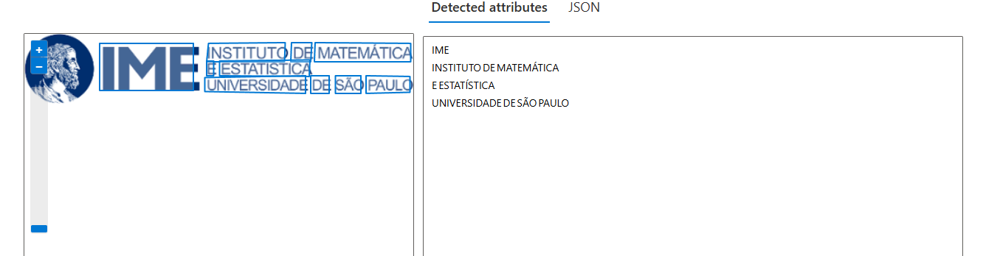
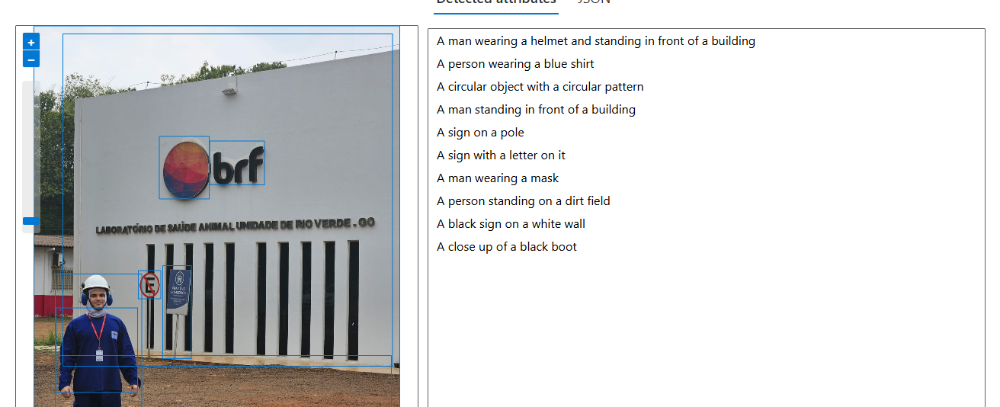

# ai-900-lab2
 arquivos para entrega do segundo lab da ceritifação AI-900 da Microsoft.

# Passo a Passo
    1. Criei o workspace do vison studio dentro da mesma capacity do lab 1.
    2. Acessei a interface de extrair texto de imagens para a "IME USP.png"
    3. Fiz o teste com a extração do texto da logo e foi 100% assertivo (vide print abaixo)
    
    4. Acessei a interface de "dense captions to images" e fiz upload da minha foto em frente ao laboratório e também foi super satisfatório
    
    5. Copiei os JSONs de resultado ao invés do puro texto para a pasta outputs pois acredito ser mais completo para a entrega
